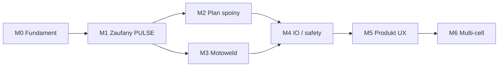
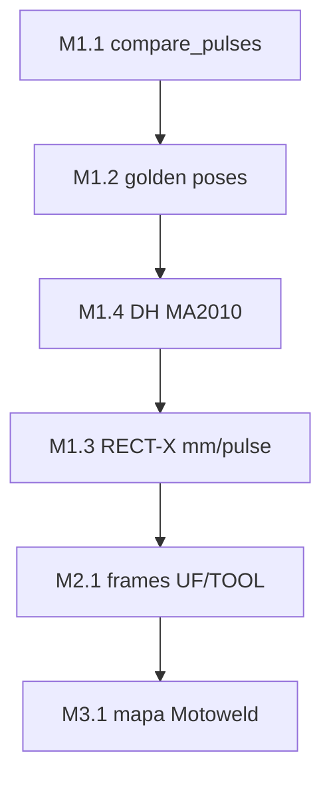
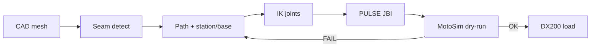

# Roadmapa — Yaskawa CAD/CAM (komórka MA2010 / DX200)

Cel produktu: **offline CAD/CAM**, które z modelu 3D prowadzi do `.JBI` zgodnego z produkcyjną komórką (MA2010 + RECT-X + TURN + Motoweld), z walidacją w MotoSim **zanim** plik trafi na DX200.

Stan dziś: prototyp UI + IK + eksport `ma2010_cell` (RECTAN albo PULSE po IK), dump CF skatalogowany, skalowanie impulsów wyciągnięte z RC1G/RBCALIB. DH i layout komórki nadal przybliżone — **nie gotowe na produkcję**.

---

## Zasady

1. Najpierw **zgodność z dumpem komórki**, potem ogólność (inne roboty AR).
2. Każdy kamień milowy kończy się **artefaktem sprawdzalnym** (test, golden JBI, dokument).
3. PULSE na kontroler tylko po **porównaniu z pendantem / MotoSim**.
4. Duży dump CF zostaje lokalnie; w git — fixtures + katalog + kod.

Powiązane: [CELL.md](CELL.md) · [CELL_DUMP_CATALOG.md](CELL_DUMP_CATALOG.md) · [HARDWARE.md](HARDWARE.md) · skill `.cursor/skills/dx200-cell-dump/`

---

## Grafy

### Zależności kamieni milowych



### Tor najbliższych 4–6 tygodni



### Przepływ produktu (docelowy)



---

## M0 — Fundament (done / utrzymanie)

| | |
|--|--|
| **Wynik** | Aplikacja działa lokalnie; eksport nie kłamie o gramatyce komórki |
| **Jest** | UI Verbotics-like, MA2010 URDF, Motoweld w komentarzach, `pulse_config`, profil `ma2010_cell`, katalog dumpa, pytest/smoke |
| **Utrzymanie** | Trzymać README/HARDWARE zgodne z MA2010+TURN (nie Lorch/H1000D jako default); CI zielone |

---

## M1 — Zaufany PULSE (następny priorytet)

**Wynik:** C#/BC#/EC# z aplikacji da się porównać z pendantem na kilku znanych pozach (± tolerancja).

| # | Zadanie | Done when |
|---|---------|-----------|
| 1.1 | Skrypt `tools/compare_pulses.py`: C# z `jobs/*.JBI` → deg → (opcjonalnie FK) | Raport różnic vs softlimits / oczekiwane limity |
| 1.2 | 5–10 **golden poses** z pendanta (deg + pulse + XYZ) | Tabela w `docs/CELL_POSES.md` |
| 1.3 | RECT-X **pulses/mm** (lead / teach) | `base_mm_to_bc` bez samego park-pulse |
| 1.4 | DH z MotoSim / datasheet MA2010 (zastąpić placeholdery) | FK vs pendant &lt; kilku mm na golden set |
| 1.5 | Eksport UI: zawsze ścieżka IK → PULSE; jasny status gdy IK fail | Status PL/EN już częściowo; dokończyć UX |

**Wyjście M1:** „draft PULSE” nadający się do dry-run w MotoSim na prostej spoiny.

---

## M2 — Planowanie spoiny pod komórkę

**Wynik:** Od CAD do sekwencji ruchów z TOOL0, UF, stacją i bazą — nie tylko demo T-fillet.

| # | Zadanie | Done when |
|---|---------|-----------|
| 2.1 | Rejestr ram: TOOL / USER (`docs/CELL_FRAMES.md`) z teach jobs | Znane `UF#` używane w produkcji |
| 2.2 | Wybór stacji ST1–ST4 + group w eksporcie | JBI z właściwym `GROUP2` |
| 2.3 | BC# z pozycji szyny (mm), nie stały park | Ruch bazy w ścieżce |
| 2.4 | TouchSense / search zgodne z `SRCH-*` / `SZUKAJ*` (wzorzec) | Opcjonalny blok przed ARCON |
| 2.5 | Kolizje: coarse AABB → modele cube z `CUBEINTF` | Flaga kolizji bliższa rzeczywistości |
| 2.6 | Multi-seam sequence (kolejność, retract) | Już częściowo; domknąć pod 4 stacje |

**Wyjście M2:** Program na jedną stację z sensowną sekwencją air/weld/retract.

---

## M3 — Proces spawania (Motoweld, nie ASF#)

**Wynik:** `MACRO1 ARGF` / warunki ↔ tabele kontrolera; UI nie udaje Lorch ASF.

| # | Zadanie | Done when |
|---|---------|-----------|
| 3.1 | Mapa ARGF / cond → `ARCSRT` EN + `WELDUDEF` USER-n | `docs/CELL_WELD_MAP.md` |
| 3.2 | WPS przykładowe (A/V/wire/travel) + ostrzeżenie „nie kwalifikowane” | UI + komentarze JBI |
| 3.3 | `WEV#` używane w live jobs (grep) → lista w UI | Dropdown rzeczywistych weaves |
| 3.4 | Gas / stickout / wire defaults z komórki | Dokument + default schedule |

**Wyjście M3:** Operator wybiera warunek jak na uczniu, nie „Lorch job #”.

---

## M4 — Bezpieczeństwo i IO komórki

**Wynik:** Wygenerowany job respektuje kurtyny/bramy/cube albo jawnie ich nie zawiera (z checklistą).

| # | Zadanie | Done when |
|---|---------|-----------|
| 4.1 | Mapa IO z jobów bram/kurtyn | `docs/CELL_IO.md` |
| 4.2 | Opcja „opakuj w STACJA_n” (CALL pattern) | Master job + child weld |
| 4.3 | YSFLOGIC / shock — skrót dla integratora | Notatka w docs |
| 4.4 | Checklist offline→online (MotoSim → CF) | `docs/GO_LIVE.md` |

**Wyjście M4:** Ścieżka wdrożenia zrozumiała dla integratora Yaskawy.

---

## M5 — Produkt (UX / jakość)

**Wynik:** Aplikacja używalna na hali / biurze technologii, nie tylko demo.

| # | Zadanie | Done when |
|---|---------|-----------|
| 5.1 | Import CAD → spoiny → plan → symulacja → eksport jako jeden flow | Mniej „demo buttons” |
| 5.2 | Podgląd JBI w UI (diff vs `000.JBI` grammar) | Panel kodu |
| 5.3 | Symulacja TCP + opcjonalnie joint z IK | Suwak czasu już jest; dociągnąć joint |
| 5.4 | README = MA2010 cell (sprzątnięcie AR/Lorch default) | Docs = kod |
| 5.5 | Skan dumpa: `tools/scan_dx200_dump.py` odświeża katalog | Jedna komenda po nowym CF |

**Wyjście M5:** Spójny produkt „ArcNC / cell CAD-CAM” pod tę instalację.

---

## M6 — Skala / multi-cell (później)

- Inne modele (AR2010…) jako profile, nie default.
- Multi-robot / druga szyna.
- Integracja z MotoSim API / batch validation (jeśli dostępne).
- Auth, projekty, wersjonowanie programów spawania.

Nie zaczynać M6, dopóki M1–M2 nie dają powtarzalnego dry-run.

---

## Kolejność rekomendowana (najbliższe 4–6 tygodni)

```
M1.1 compare_pulses  →  M1.2 golden poses  →  M1.4 DH
        ↓
M1.3 RECT-X mm/pulse  →  M2.1 frames  →  M2.2–2.3 station/base
        ↓
M3.1 weld map  →  M4.4 go-live checklist  →  M5.4 docs sync
```

---

## Definition of Done — „można próbować w MotoSim”

- [ ] Golden poses: błąd pozycji TCP w limicie uzgodnionym z integratorem  
- [ ] Eksport PULSE przechodzi parse / load w MotoSim bez alarmu formatu  
- [ ] Brak kolizji w modelu komórki na ścieżce demo  
- [ ] Warunek spawania zmapowany do istniejącego EN/USER na kontrolerze  
- [ ] Checklist GO_LIVE podpisany przez osobę odpowiedzialną za komórkę  

Dopiero potem: load na DX200 w trybie teach / restricted.

---

## Poza zakresem (świadomie)

- Autonomiczne wgrywanie `CMOS.BIN` / pełnego CF z CI  
- Gwarancja bezkolizyjności bez MotoSim  
- Kwalifikacja WPS / certyfikacja procesu  
- Sterowanie robotem online (tylko generacja jobów offline)
